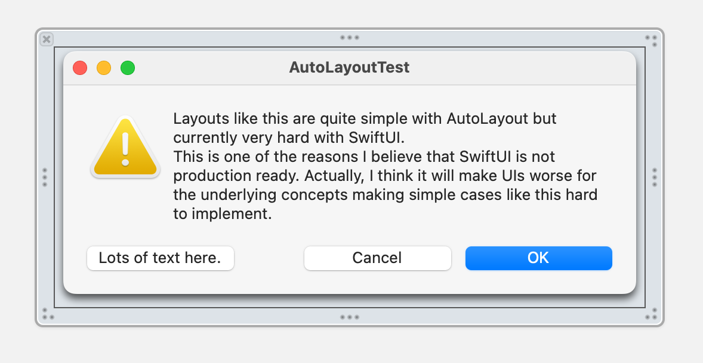

# 10min AutoLayout Challenge

Video demo: <https://twitter.com/teilweise/status/1295700159184154624>

Can you recreate this layout in 10min in SwiftUI?

Behavior when resizing the window:

- If the window is wide enough, all buttons have the same width.
- When shrinking, the "OK" and "Cancel" buttons shrink until the intrinsic content size (of the text label) is reached.

